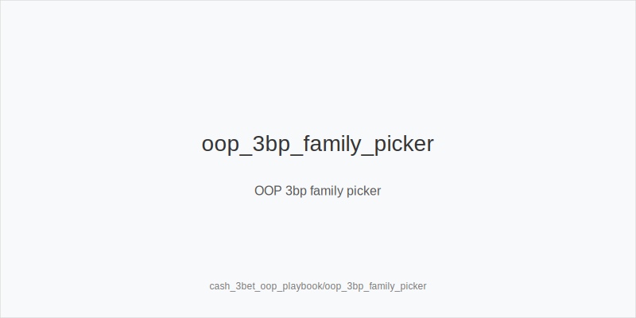
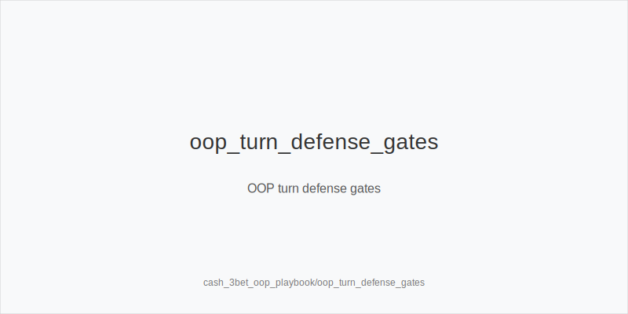
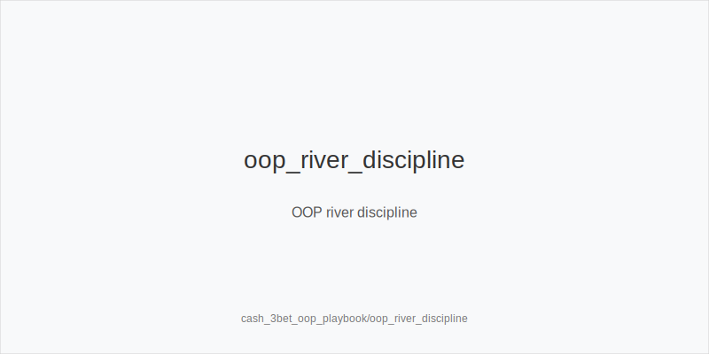

# What it is
Playbook for OOP 3-bet pots from the blinds. Use fixed ladders: preflop **3bet_oop_12bb**; postflop **small_cbet_33, half_pot_50, big_bet_75**. Families: **size_down_dry** (static) and **size_up_wet** (dynamic). No off-tree lines or new sizes.

# Why it matters
OOP after 3-betting has lower SPR and higher raise risk. EV comes from picking the right family by texture, protecting checks, blocker-gated pressure, and river discipline. Patterns transfer to 6-max and HU.

# Rules of thumb
- **Preflop:** Default **3bet_oop_12bb**; widen only with evidence. Sets SPR and prices IP calls.
- **Texture:** Static -> **size_down_dry** + **small_cbet_33**; dynamic -> **size_up_wet** + **half_pot_50**. Family first, then size.
- **Checks & delay:** Add **protect_check_range** on stabby boards; at mid SPR vs raise-prone IP, prefer **delay_turn**.
- **Upgrade:** Use **big_bet_75** only with top blockers and Fv75 spike; otherwise keep **half_pot_50**.
- **Second barrels:** On dynamic turns, **double_barrel_good** with equity + blockers; otherwise 50%.
- **Probe:** Only **probe_turns** after flop **chk-chk**.
- **River:** Facing polar **big_bet_75** without blockers -> fold. Call only with top blockers and evidence.
- **Raise-prone:** Reduce flop c-bet frequency, add **protect_check_range**, lean on **delay_turn**.
- **Multiway:** Realization drops; prefer merged **half_pot_50** and fewer pure bluffs.
- **Turn->river:** If turn **big_bet_75** leaves trivial behind, require blockers/equity; else stay at **half_pot_50** or **delay_turn**.
- **Economics:** In rakey games, trim thin OOP bluffs/calls; prefer value-heavy 3-bets. In time games, keep volume-friendly lines.

# Mini example
- **Static:** SB 3bets BTN (12bb). Flop A83r -> **size_down_dry + small_cbet_33**. Turn raise-prone -> **delay_turn**. River faces **big_bet_75** without blockers -> fold.
- **Dynamic:** BB 3bets CO. Flop JT9ss -> **size_up_wet + half_pot_50**. Turn scare with top blockers + Fv75 -> **big_bet_75** (**double_barrel_good**).
- **After checks:** MP opens, BB 3bets, MP calls. Flop K72r checks through -> **chk-chk** -> good turn card -> **probe_turns**.

# Common mistakes
- Auto **small_cbet_33** on wet textures (invites raises and gives equity).
- Upgrading to **big_bet_75** without blockers/evidence.
- Calling river **big_bet_75** without blockers.
- Mislabeling a turn probe_turns (probe only after chk-chk).
- Over c-betting into raise-prone IP; skipping **protect_check_range**/**delay_turn**.

# Mini-glossary
**Raise risk:** likelihood IP raises your bets; pushes toward **delay_turn** and protected checks. 
**Protected checks:** **protect_check_range** mixes checks that can continue vs stabs. 
**Probe sequence:** **Sequence: chk-chk** -> **probe_turns**. 
**Blocker gates:** use key blockers to unlock **big_bet_75** and some river calls. 
**Fv50/Fv75:** fold vs size rates guiding 50% vs 75% choices.
EV: Expected Value - the average amount you'd win or lose if you made the same play many times

# Contrast
Unlike **cash_3bet_ip_playbook**, OOP play emphasizes **protect_check_range**, **delay_turn**, and gated upgrades instead of broad c bet pressure. Same tokens, same **33/50/75** families-only frequencies shift.

See also
- cash_blind_defense_vs_btn_co (score 27) -> ../../cash_blind_defense_vs_btn_co/v1/theory.md
- cash_turn_river_barreling (score 27) -> ../../cash_turn_river_barreling/v1/theory.md
- donk_bets_and_leads (score 27) -> ../../donk_bets_and_leads/v1/theory.md
- hu_postflop_play (score 27) -> ../../hu_postflop_play/v1/theory.md
- live_chip_handling_and_bet_declares (score 27) -> ../../live_chip_handling_and_bet_declares/v1/theory.md

What it is

Why it matters

Rules of thumb

Mini example

Common mistakes

Mini-glossary

Contrast
