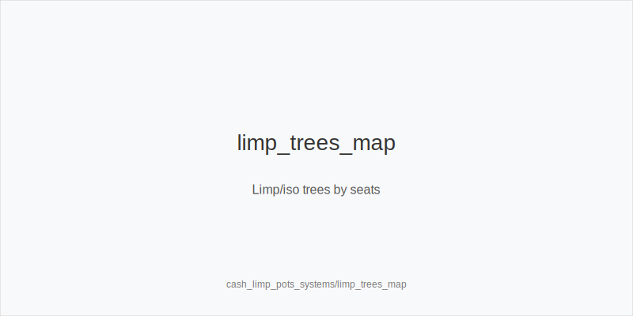
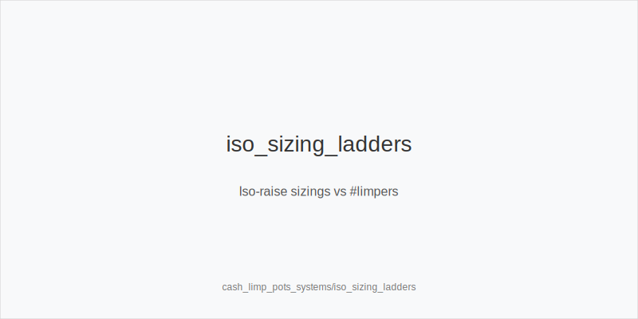
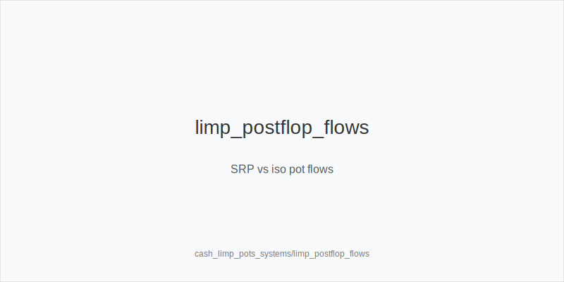

What it is
Limp pots start when one or more players enter the pot for the minimum without raising. Your choices are isolate (raise), overlimp (call), or check in the blinds. Iso aims to play heads-up in position versus a capped range. Overlimp aims to realize equity cheaply in multiway. In the blinds, you often check and play postflop with range advantage only on some textures.

Why it matters
Correct iso sizes reclaim initiative and set clean SPRs; good overlimps realize cheaply. Poor choices bloat pots OOP, invite multiway, and force tough turns where equity realizes poorly.

Rules of thumb
- Iso basics: IP vs 1 limper ~5-6bb; +1bb per extra. OOP ~7-9bb; +1-2bb per extra. Size up vs sticky/deep; size down at 40-60bb to keep turn jam trees clean.
- Range shape: linear versus weak fields (broadways, pairs, suited). Add blocker bluffs (Axs/Kxs) more IP. Trim offsuit junk OOP.
- Overlimp policy: take the price with suited connectors/gappers and small pairs behind passive limpers. Avoid dominated overlimps when squeeze risk is high.
- Postflop after iso: small_cbet_33 on dry Axx/Kxx; half_pot_50 on middling; size_up_wet only with strong equity on T98/QJT two-tone. OOP protect_check_range and defend raises tighter.
- Limp-checked pots: IP stab often on boards that miss ranges; if flop checks through and a turn favors you, probe_turns. When pools overfold OOP turns, half_pot_50 with overfold_exploit.
- Turn/river: delay_turn on favorable cards; double_barrel_good on range-shifting turns; triple_barrel_scare only with a credible story and blockers.
- Escalation: if a frequent limper starts raising, fold marginal overlimps and consider 3bet_oop_12bb from blinds versus late steals.

Mini example
HJ limps 100bb. CO isolates to 6bb. Folds to limper call. Pot ~13.5bb; SPR ~7. Flop K72r: CO small_cbet_33 ~4.5bb; call. Turn 5x: CO half_pot_50 ~11bb to deny and set river geometry; fold.

Common mistakes
- Using open sizes as iso sizes (invites multiway).
- Overlimping OOP with offsuit broadways (poor realization).
- Calling limp-raises too wide without position/blockers.
- Autopilot big_bet_75 on wet flops without equity.

Mini-glossary
Iso raise: raise over one or more limpers to isolate a weak range and take initiative.
Overlimp: call behind a limper to see a flop cheaply with playable suited/connected hands.
small_cbet_33 / half_pot_50 / big_bet_75: pot-based families for flop/turn sizing.
size_up_wet / size_down_dry: directional adjustments by board texture.
probe_turns / delay_turn: take the betting probe_turns on turns after missed c-bets.
protect_check_range: structured checks to keep medium-strength hands safe.
overfold_exploit: intentional pressure where pools fold too often in a node.
double_barrel_good / triple_barrel_scare: turn/river aggression triggers.
EV: Expected Value - the average amount you'd win or lose if you made the same play many times

Contrast
Unlike standard raised pots, limp pots begin with capped ranges and higher fold equity IP. Versus blind-vs-blind steals, you target a single weak range and use tailored iso sizes to avoid multiway and awkward OOP SPRs.

See also
- cash_blind_defense_vs_btn_co (score 27) -> ../../cash_blind_defense_vs_btn_co/v1/theory.md
- cash_short_handed (score 27) -> ../../cash_short_handed/v1/theory.md
- donk_bets_and_leads (score 27) -> ../../donk_bets_and_leads/v1/theory.md
- live_chip_handling_and_bet_declares (score 27) -> ../../live_chip_handling_and_bet_declares/v1/theory.md
- cash_3bet_oop_playbook (score 25) -> ../../cash_3bet_oop_playbook/v1/theory.md