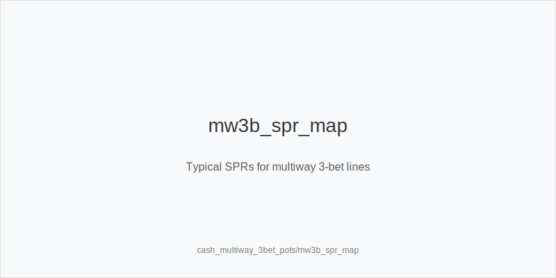
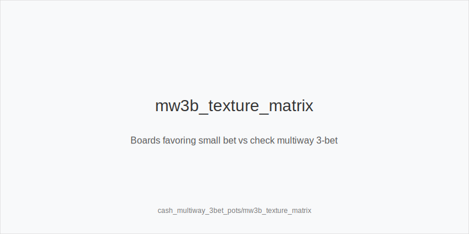
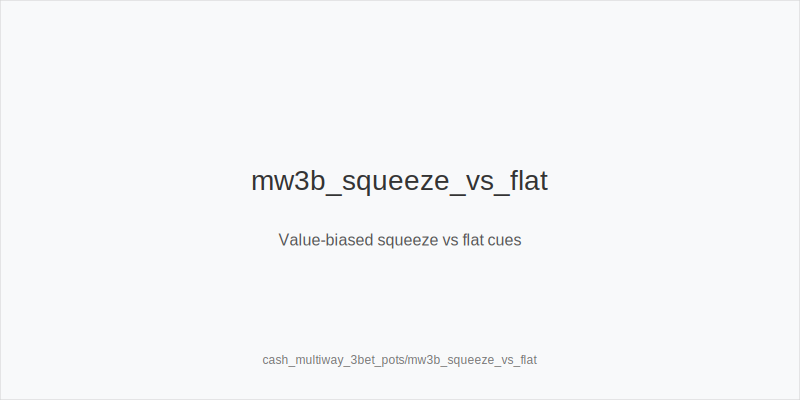

What it is
Multiway 3-bet pots happen when a raise is 3-bet and two players continue (open + call, IP 3-bet, both call; or open, BB 3-bets OOP, both call). Ranges condense toward broadway, suited, and pairs. Typical sizes: 3bet_ip_9bb versus 2.2-2.5bb opens; 3bet_oop_11bb from blinds. Cold calls are rare but common enough at low/mid stakes to create these nodes.

Why it matters
SPR is low-ish (~2.7-3.4 IP; ~2.5-3.0 OOP). Bluff EV falls and reverse implied risk rises. As pots grow, rake share shrinks, so value extraction and equity denial dominate. One mis-sized bet can snowball across two opponents. Plan rivers early and avoid thin stabs into two ranges.

Rules of thumb
- Preflop leverage: prefer value-biased squeeze_iso_3bet; avoid_bloated_pot_oop with marginals. IP flats must realize well (suited, connected, high card).
- Flop sizing: size_down_dry with small_cbet_33 on Axx/Kxx dry; half_pot_50 when ranges are closer; big_bet_75 only with strong equity on volatile T98/QJT two tone.
- Position plans: IP delay_cbet_ip and probe_turns after checks; OOP protect_check_range and defend_vs_small_cbet tighter.
- Raise respect: fold_vs_raise_multiway more; continue with top pair + good kicker, overpairs, or strong combo draws; raise_for_protection only on very volatile boards.
- Turn/river: deny_equity_turn on scare/improving cards; polarize_river when ranges cap and draws miss.

Mini example
UTG opens 2.5bb, CO calls, BB 3-bets to 11bb. UTG calls, CO calls. Pot ~33.5bb; stacks ~89bb; SPR ~2.7. Flop A72r: BB small_cbet_33 ~11bb; UTG folds, CO calls. Turn 5x adds wheel gutters: BB half_pot_50 ~28bb to deny_equity_turn versus 86/A5; CO folds.

Common mistakes
- Over-bluffing like heads up (fold equity is lower across two ranges).
- Disrespecting raises (multiway raises are value-weighted; fold more).
- Bad preflop flats OOP (awkward SPRs and poor realization).

Mini-glossary
small_cbet_33: About one-third-pot c-bet for cheap denial and range protection.
half_pot_50 / big_bet_75: Medium/large bets for closer ranges or high-volatility
denial on dynamic boards.
squeeze_iso_3bet: Value-biased 3-bet over open + caller(s) with blockers and
playability.
protect_check_range: Structured checks OOP that keep mediums and avoid face-up
weakness.
EV: Expected Value - the average amount you'd win or lose if you made the same play many times

Contrast
Heads-up 3-bet pots allow more bluffing and bigger footprints; single-raised
multiway pots keep SPR higher and use even smaller sizings. Multiway 3-bet pots
sit between: low-ish SPR, fewer bluffs, stricter raise respect, sharper position
edge, and tighter value thresholds.

_This module uses the fixed families and sizes: size_down_dry, size_up_wet; small_cbet_33, half_pot_50, big_bet_75._

See also
- cash_blind_defense_vs_btn_co (score 23) -> ../../cash_blind_defense_vs_btn_co/v1/theory.md
- cash_population_exploits (score 23) -> ../../cash_population_exploits/v1/theory.md
- donk_bets_and_leads (score 23) -> ../../donk_bets_and_leads/v1/theory.md
- hand_review_and_annotation_standards (score 23) -> ../../hand_review_and_annotation_standards/v1/theory.md
- live_chip_handling_and_bet_declares (score 23) -> ../../live_chip_handling_and_bet_declares/v1/theory.md