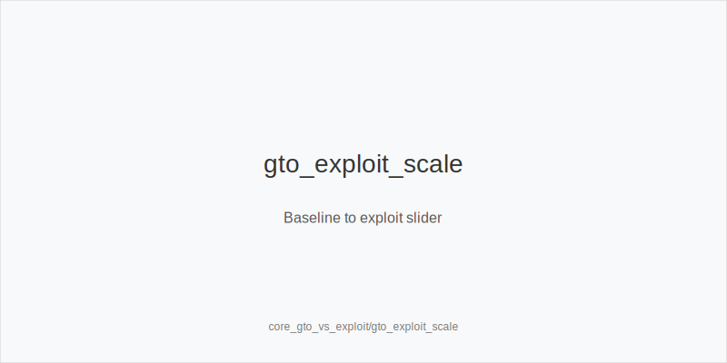
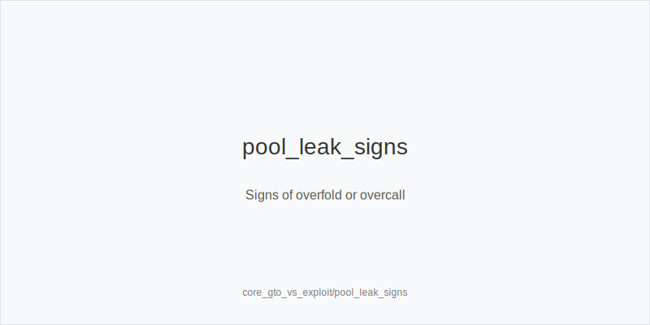
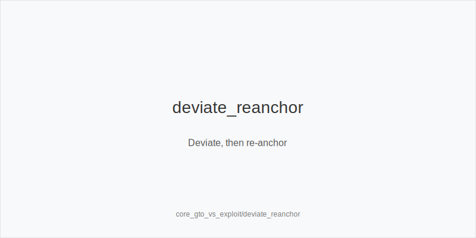

# Theory Micro-Loop

## Key Idea
- Start from a [[term:GTO]] baseline for protection, spot reliable leaks, [[term:EXPLOIT]] with sizing/[[term:FREQUENCY]], and re-anchor whenever the table shifts.

## Mini-Example
- CO opens 2.2 bb, BTN calls. Baseline calls for a small c-bet. Read: BTN keeps overfolding to bigger flop bets, so CO polarizes with an 80% pot bet containing strong Kx and natural bluffs, BTN folds, and CO logs the read to re-anchor later.

## Actionable Rules
- Use sound baseline ranges/sizes until solid evidence justifies deviation.
- Deviate only with proof: history, pool stats, HUD notes, or clear showdowns.
- Match lever to leak: overfolders get [[term:POLARIZATION]] big bets and more bluffs; overcallers get [[term:THIN_VALUE]] and fewer bluffs.
- Adjust sizes, not just hand selection: size up [[term:POLARIZATION]] vs capped ranges and shrink toward [[term:MERGE]] bets vs stations.
- Re-anchor promptly when opponents adapt or leave, then rebuild reads before the next [[term:EXPLOIT]].
- Track your adjustments and review them each orbit to keep discipline.

## Quick Check
- What tells you to deviate from baseline instead of sticking to a [[term:GTO]] plan?
- How do you re-anchor once an opponent stops showing the same leak?

See also
- hand_review_and_annotation_standards (score 18) -> ../../hand_review_and_annotation_standards/v1/theory.md
- hu_exploit_adv (score 18) -> ../../hu_exploit_adv/v1/theory.md
- icm_mid_ladder_decisions (score 18) -> ../../icm_mid_ladder_decisions/v1/theory.md
- live_etiquette_and_procedures (score 18) -> ../../live_etiquette_and_procedures/v1/theory.md
- live_full_ring_adjustments (score 18) -> ../../live_full_ring_adjustments/v1/theory.md
