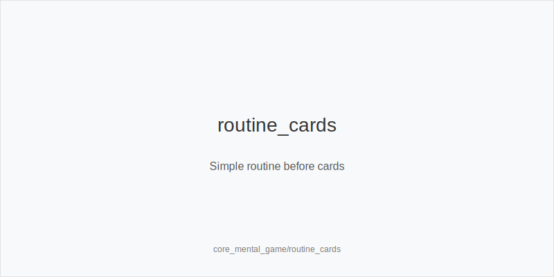
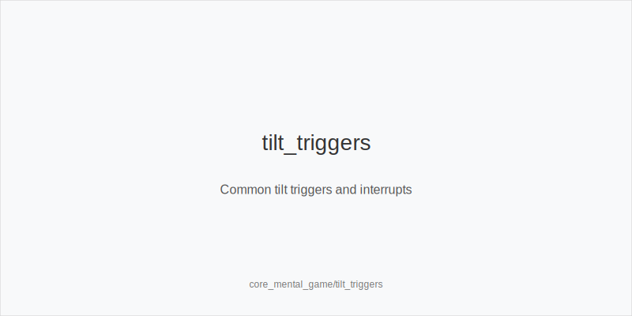
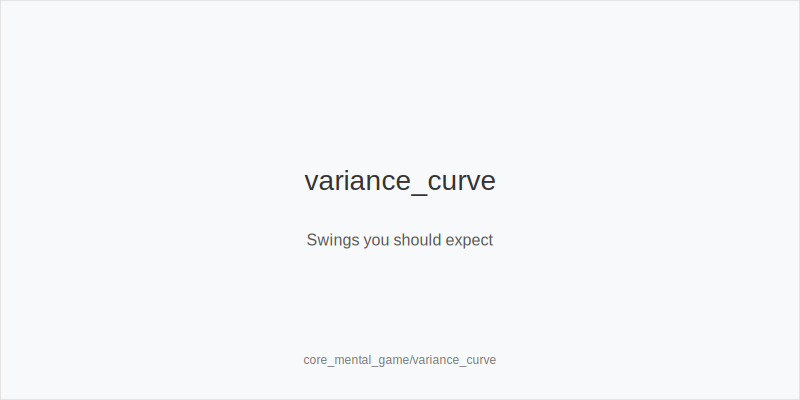

# Theory Micro-Loop

## Key Idea
- A steady mental game relies on routines, [[term:TILT]] interrupts, and [[term:VARIANCE]] literacy so you keep decisions sharp through swings instead of drifting into emotion-driven play.

## Mini-Example
- CO folds K72 5 2, feels [[term:TILT]], takes a 10-second breathe-reset, tags the hand, drops from four tables to three, and walks for water before returning calm for the next orbit.

## Actionable Rules
- Run a pre-session checklist: sleep, food, hydration, clear goal, time box, stop-loss, end-on-time, and one A-game cue.
- Define firm stop-loss/end-on-time limits to prevent chase-[[term:TILT]] and fatigue.
- Use fast interrupts: breathe-reset 10 seconds, stand, or walk for 2 minutes when arousal spikes.
- Tag hands for later review without replaying them mid-session.
- Protect attention by reducing tables, silencing notifications, muting toxic chat, and shifting tables when needed.
- Accept [[term:VARIANCE]]: expect swings even with solid play so you stay steady through heaters and downswings.

## Quick Check
- What does your pre-session checklist include, and why does it matter?
- How should you interrupt [[term:TILT]] without turning the session into a break?

See also
- cash_3bet_oop_playbook (score 5) -> ../../cash_3bet_oop_playbook/v1/theory.md
- cash_blind_defense (score 5) -> ../../cash_blind_defense/v1/theory.md
- cash_blind_defense_vs_btn_co (score 5) -> ../../cash_blind_defense_vs_btn_co/v1/theory.md
- cash_blind_vs_blind (score 5) -> ../../cash_blind_vs_blind/v1/theory.md
- cash_delayed_cbet_and_probe_systems (score 5) -> ../../cash_delayed_cbet_and_probe_systems/v1/theory.md
