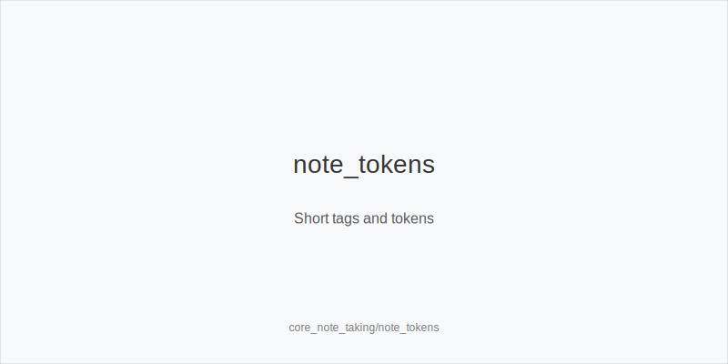
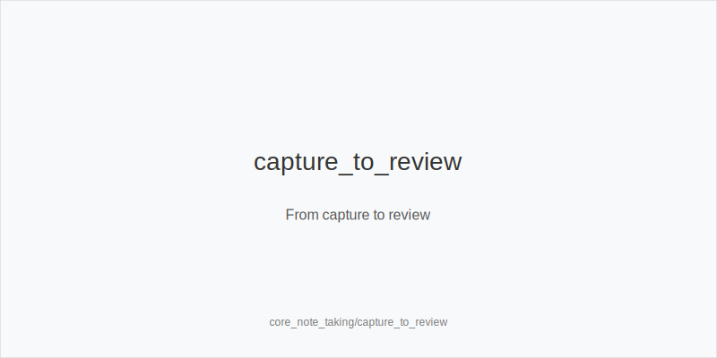
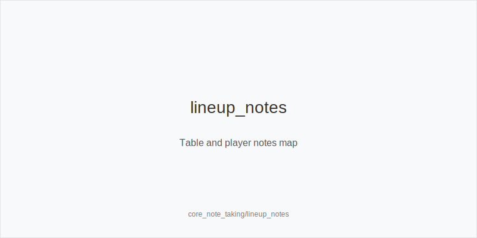

# Theory Micro-Loop

## Key Idea
- Capture fast, structured poker [[term:NOTE]]s and route them into a simple study loop so you stay present while turning mistakes, reads, and [[term:LEAK]]s into future action.

## Mini-Example
- CO vs UTG SRP on K72r: capture "call small, turn 5, fold to second barrel," tag the player with "folds_turn_vs_double_small," and send the hand to study_spot for flop-defense work.

## Actionable Rules
- Keep [[term:NOTE]]s atomic: record action, texture, size, and result in one short line.
- Tag players with stable traits (overfold_flop, calls_down, tiny_3bet) to make reads reusable.
- Capture minimal info in-session and do deep review post-session so you do not miss live decisions.
- Always [[term:NOTE]] positions and size families (e.g., CO vs BTN, small/medium/large).
- Route every hand to fix_now, study_spot, or player_read to prevent backlog.

## Quick Check
- What does a quality [[term:NOTE]] contain, and why do you record it quickly?
- Where does each captured hand go after the session?

See also
- cash_3bet_oop_playbook (score 5) -> ../../cash_3bet_oop_playbook/v1/theory.md
- cash_blind_defense (score 5) -> ../../cash_blind_defense/v1/theory.md
- cash_blind_defense_vs_btn_co (score 5) -> ../../cash_blind_defense_vs_btn_co/v1/theory.md
- cash_blind_vs_blind (score 5) -> ../../cash_blind_vs_blind/v1/theory.md
- cash_delayed_cbet_and_probe_systems (score 5) -> ../../cash_delayed_cbet_and_probe_systems/v1/theory.md
