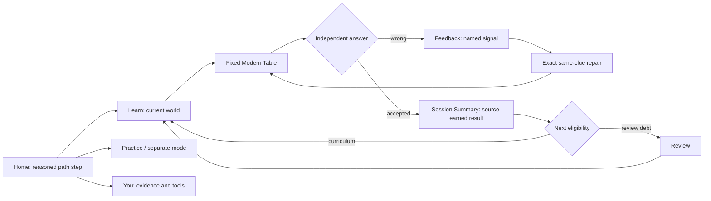
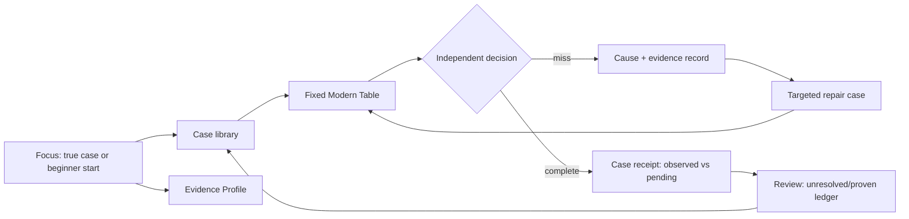
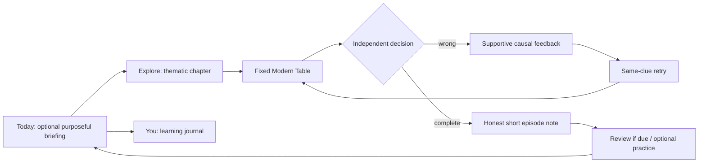

# S04 D3 - Whole-Product Concept Competition and Gate Decision

**Status: PASS_D3_CONCEPTS_READY_FOR_S05** (design deliverables only). **NEXT_ACTIVE_TASK_ID: S05**, owner design direction, owner verdict pending. This does not select/adopt a concept. No product code, table artwork, native screenshots, Human or P02.
**Verified starting main:** `9e4aa05ce843441a477343b461800fe94b8237e9`; tree `a02a4ef79146b30b5372ce77033cc2076bd915c6`. S02 and S03 merged receipts are the authority for observations/research. Design file: `docs/design/s04_three_concept_screen_board_20261010.html` (24 static mobile wireframes; eight shared screen classes x A/B/C). Research baseline: `SHARKY_CROSS_INDUSTRY_DESIGN_RESEARCH_PACKET_v1.zip` SHA-256 `e99ea45a084a4e9d6d32725bd0c550c75a0caf77dabe96112b57b89063c5e02b`, companion S03 V3 validation handover.

## Matched evidence baseline - no synthetic success
- **OBSERVED_NATIVE:** Placement/Welcome/Home, Learn/W1 theory and choice, Practice/Review/You, actual wrong/repair and F04/F07/F09/F11, true process relaunch persistence, real negative guide result `3/4 correct / 75% assessed / Needs review / replay before next lesson`, returned through Learn/Review.
- **NOT_PROVEN:** positive earned Session Summary, joined recap -> Home -> next useful action, natural Review empty, long-copy and large-text native full stress. Concept boards illustrate these interaction contracts as proposals, NOT achieved screens.
- **NOT_YET_DUE:** independent review for `hero_cards_board_pot`, next due UTC `2026-10-10T23:07:41.620229Z` as of actual earlier V5 observation; never artificially due.
- **PROTECTED:** fixed Modern Table geometry/art and source-owned seat/hand truth, PR #224 separate, existing deterministic Act0 lesson/repair/telemetry/durable progress owners; no auto Mastery, no phantom W1-W12 unlock.
- Same user model for all boards: novice, one observed wrong board-count signal, negative `3/4` result, one unresolved/needs-review debt, review not currently due. All illustrative navigation and copy are S04 hypotheses.

## Three competing primary information architectures

### A - Guided Academy: primary object = course path / next lesson
Home selects one curriculum-contiguous next action with source-backed reason; Learn is visible sequential worlds and real lock states; Practice is a branch of current skill, Review a named obligation, You a transparent route/evidence record. Positive payoff must come from actual independent events; negative results remain negative.
**Navigation:** Home / Learn / Practice / Review / You; Home defaults to the current path, not a dashboard of equal tiles. Sharky guides transitions, not live table answers.
**Flow:**

**Failure hypothesis:** course path can over-constrain advanced learners and downplay independent Review. S05 must decide beginner-first commitment and voluntary Review access.

### B - Decision Lab: primary object = active decision/repair case
Home foregrounds one eligible source-backed error and its causal reason, otherwise first beginner case (no fabricated diagnosis); Learn organizes causal skills with protected curriculum fallback; Practice offers independent reps; Review is the main case workbench; You is an evidence ledger with proof class/time.
**Navigation:** Focus / Cases / Practice / Review / Evidence; Review and case contexts dominate the path, higher transformation and state-mapping cost.
**Flow:**

**Failure hypothesis:** expert vocabulary and empty-history state can overwhelm novices; same-signal repair is not independent spaced mastery. S05 would require source-compatible case grouping without new state owners.

### C - Companion Ritual: primary object = a purposeful short learning episode
Home has one optional low-pressure guided prompt backed by real eligible content; Learn exposes compact thematic chapters; Practice is readily accessible; Review gives due-truth reminders without streak penalties; You stores a learning journal, not score identity. Coach stays silent during independent decision.
**Navigation:** Today / Explore / Practice / Review / You; emotional support is optional and subordinate to poker truth.
**Flow:**

**Failure hypothesis:** extra writing/Coach-state complexity, decorative gratification or guilt loops without measured retention lift; don't claim a literal five-minute duration absent route instrumentation.

## Matched screen-to-screen comparison
| Learner job (identical for all) | A Guided Academy | B Decision Lab | C Companion Ritual |
| --- | --- | --- | --- |
| Home / next useful action | Current path node + *reason* | Eligible repair case + evidence reason; otherwise first lesson | Optional purposeful episode, no streak pressure |
| Learn / Worlds | Sequential visible path + truthful locks | Causal case categories with beginner fallback | Compact chapters with clear curriculum entry |
| Modern Table boundary | Same protected scene; independent answer below | Same protected scene; case chrome outside | Same protected scene; Coach silent on decision |
| Wrong / exact repair | Inline named signal -> true same-clue retry | Causal case -> exact matched repair | Gentle post-choice explanation -> true retry |
| Summary | Path milestone only when actually earned; 3/4 negative as real | Evidence receipt separates miss, assisted, independent pending | One earned note; negative 3/4 remains explicitly unresolved |
| Review | Clear obligations and direct return to path | Core unresolved/proven case workbench | Low-pressure no-due state, optional practice |
| You | Course/evidence record + truthful first-start tools | Evidence ledger and provenance classes | Learning journal + truthful first-start tools |
| Empty / long copy | No debt -> resume path; scroll text and anchored CTA | No case -> first basics, no phantom metrics; long rationale scroll | No due -> welcome back without penalty; long note scroll |

## Current defects F04/F07/F09/F11: not erased
| Defect | A treatment | B treatment | C treatment | Authoritative future wave |
| --- | --- | --- | --- | --- |
| F04 P1 Welcome wrong 'Try same clue' misroutes | Retry *same* first-use prompt | Same case link to original clue | Gentle exact repeat, not handoff | S08 if admitted; state-machine test mandatory |
| F07 P2 3/2 counter | Derive theory total from authored beats | Case step counter derived from beat list | Chapter beat counter sourced | S09 or S08 as appropriate |
| F09 P2 'two five six' Review wording | Semantic private/board/pot feedback | Explicit decision evidence, human terms | Plain language why + concise state | S09; keep raw telemetry IDs |
| F11 P2 settings destination promise | 'First start tools' card | Tools, distinct from ledger | Tools, distinct from journal | S10; no invented settings |

## Relative Product EV / cost / risk assessment
Heuristic expert comparison only. Scores 1-5, 5 = better, NOT measured user EV or percentage uplift. Weights: learning clarity 30%, earned truth/value 25%, navigation 15%, differentiated brand 10%, feasibility/complexity 10%, regression safety 10%. Feasibility and safety are reverse-risk scores (5 = easier/safer).

| Concept | Learning .30 | Earned .25 | Navigation .15 | Brand .10 | Feasibility .10 | Safety .10 | Weighted /5 | Qualitative product EV | Regression risk |
| --- | ---: | ---: | ---: | ---: | ---: | ---: | ---: | --- | --- |
| **A** | 4.7 | 4.3 | 4.1 | 3.8 | 4.4 | 4.5 | **4.37** | Highest *expected risk-adjusted* novice EV | LOW-MED |
| **B** | 4.25 | 4.8 | 4.0 | 4.8 | 2.8 | 2.8 | **4.12** | Highest potential causal differentiator; higher state/copy cost | MED-HIGH |
| **C** | 3.9 | 3.7 | 4.3 | 4.5 | 3.5 | 3.2 | **3.86** | Return-friction hypothesis; weak causal proof as primary IA | MED |

Scoring is ordinal judgment, not verified `delta EV >= 4%`. B may outrank A if S05 decisively prioritizes proof-case literacy over novice orientation and a bounded taxonomy is accepted. C is a conditional brand/return-hypothesis, not retention efficacy.

## Recommended direction (NOT adoption)
**Recommend Concept A - Guided Academy** for S05 owner deliberation: it makes the next useful learning action clear to an absolute beginner, exposes actual course progress without fake unlocks, keeps source-owned repair/review, and needs less structural state reinterpretation than B. Do not turn A into a fourth hybrid concept: A remains path-first; selectively requiring truthful evidence receipts is a cross-cutting constraint, not B as concurrent Home.
- Falsify against B on first-use clarity, ability to explain one's own mistake, and source-justified next action. Test fresh/no-history, wrong -> real repair -> no synthetic independent recheck, return with one proof and one unresolved item.
- A strengths are learner orientation and feasible change; risk Review being buried. B strongest differentiator; risk false diagnosed cases and interface density. C warm return; risk empty emotional scaffolding.
- Owner may pick A/B/C or send a *bounded* failure mode back to S04. No automatic concept selection by this receipt.

## S05 decision prerequisites and quality limits
Owner must decide one primary IA object, Review's top-level status, beginner vs experienced priority, Sharky/Coach presence, and exact route semantics. Only after explicit S05 choice may Screen Contracts specify EN/RU localization parity, copy taxonomy, type/spacing, 44pt-plus touch targets, safe areas, reduced-motion parity, empty/error/long-copy, locked worlds, available vs due Review, progressive truth, and a clickable integrated path with unmodified Modern Table interface.
S06 then separately estimates admitted implementation waves and rollback; S08-S11 must capture joined result -> Home action, positive earned summaries, error/no-debt/large-text native states. Actual Day-2/Day-7 efficacy remains S15. **S04 gate PASS** means comparison deliverables exist and a decision is ready; no implementation authorization follows.
