# Visual Master Audit Gallery v1

Final candidate: `bc3214e5a31ac4d10dd1c17fbde0b4c3617b4381`
Native workflow run: `30408676764`

All sheets below derive only from the unified 54-row native artifact. Earlier widget-test sheets are superseded and removed.

## 01 entry and handoff

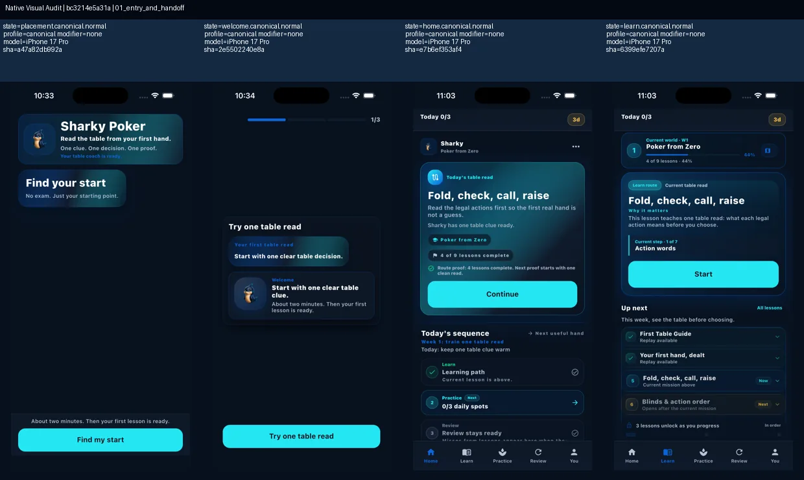

## 02 home and learn geometry

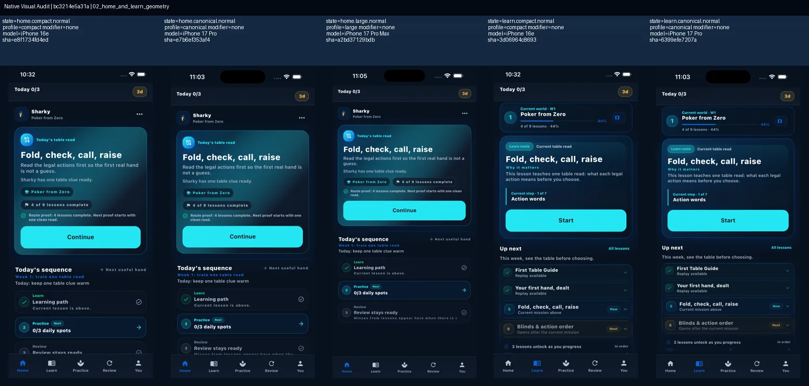

## 03 theory and table read

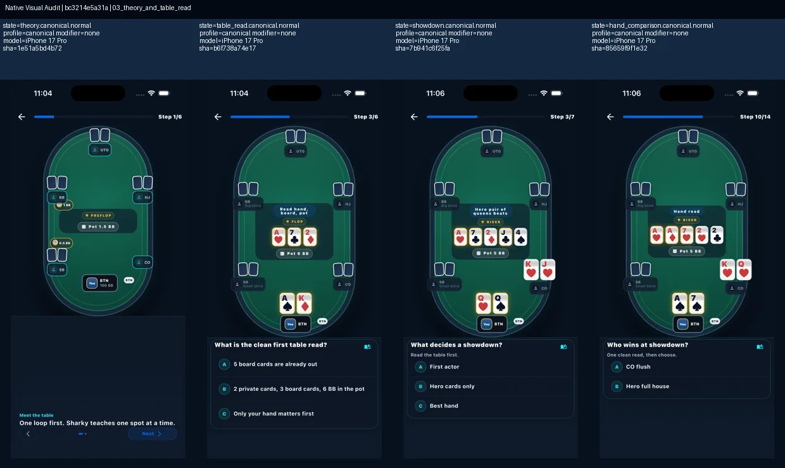

## 04 decision prompts

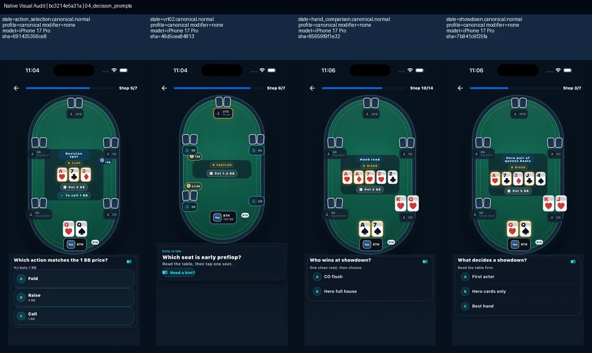

## 05 feedback and repair

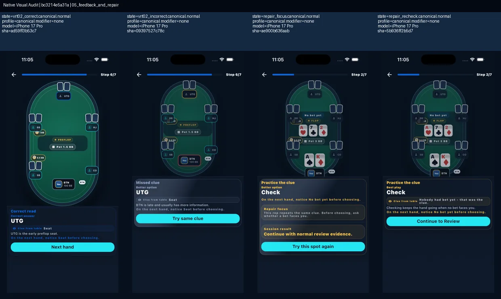

## 06 review profile and summary

## 07 completion and progress

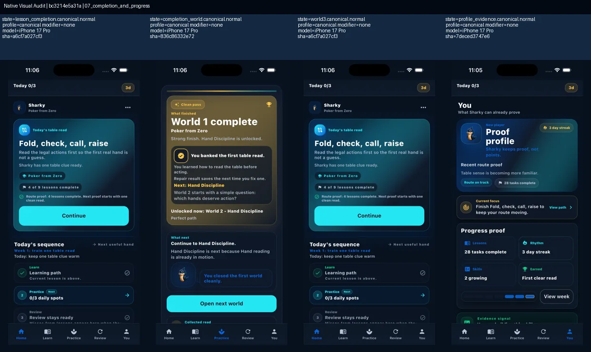

## 08 compact normal

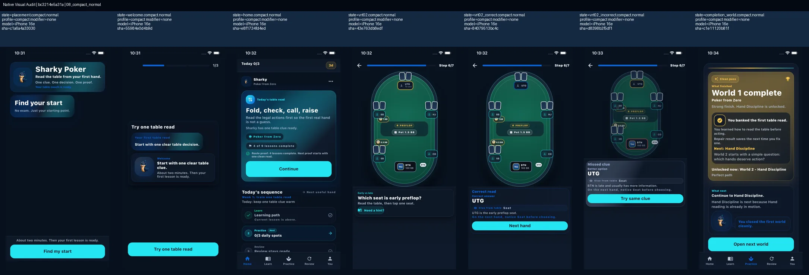

## 09 compact normal continued

## 10 text scale 1 4 core

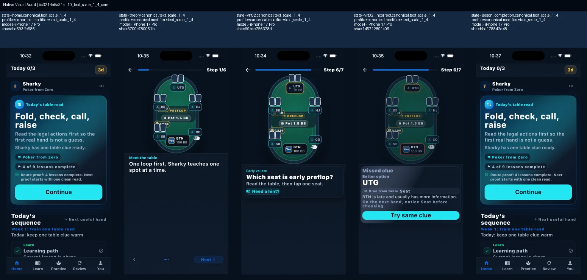

## 11 text scale 1 4 support

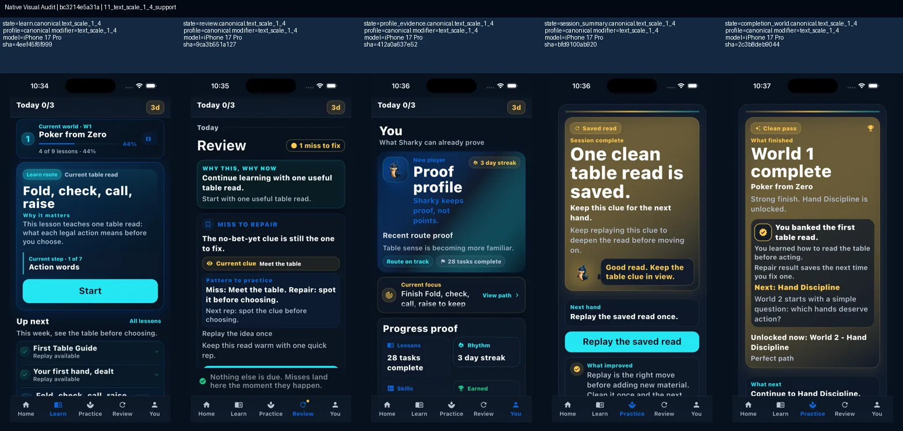

## 12 reduced motion

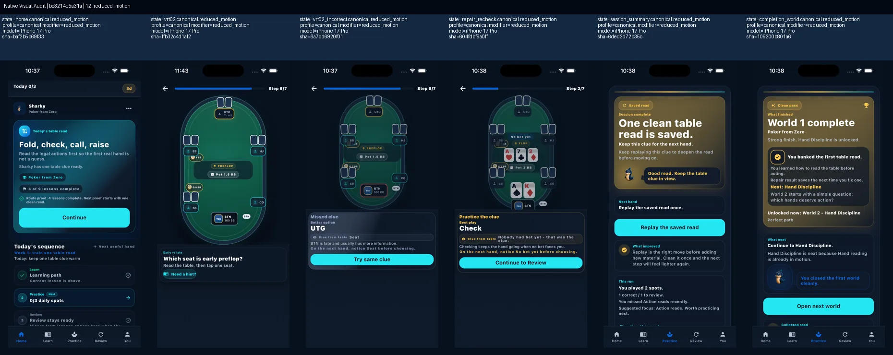

## 13 large normal

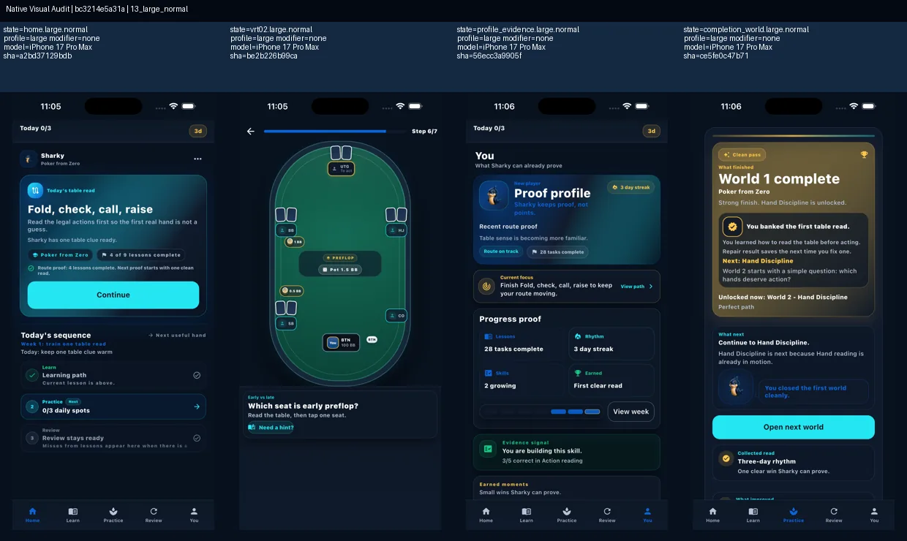

## 14 canonical normal baseline

## 15 native render fidelity

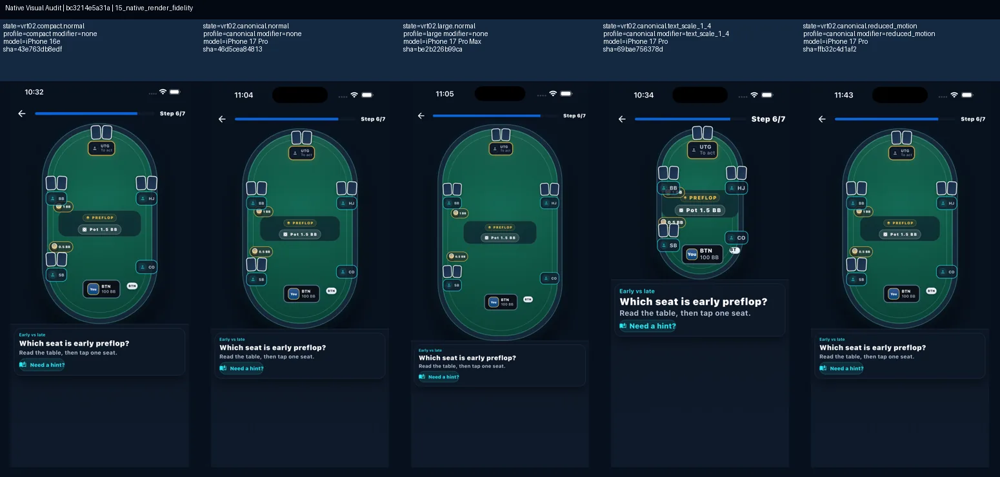
