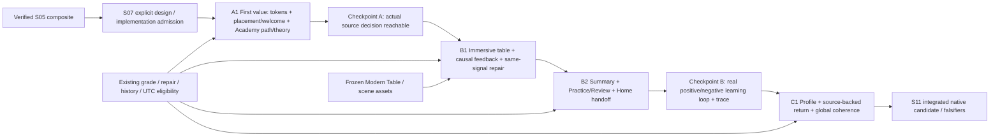

# S06 D5 - One-product EV implementation wave map

Planning baseline: verified main `8c6d780b394685a9f663c305ce8c90a24c7d337d` after S05 docs PR #258. Approved composite: `docs/design/s05-approved-20261010/README.md`. Companion source crosswalk: `S06_SOURCE_FEASIBILITY_AND_OWNERSHIP_20261010.md`; evidence/risk ledger: `S06_RISK_AND_EVIDENCE_HANDOFF_20261010.md`.

S06 is PLANNING ONLY. Three waves are recommended, corresponding to Master Plan v5 section10A S08-S10. No S08 branch or product edit is authorized. S07 must explicitly admit production implementation. Expected EV is qualitative hypothesis; no claimed learner uplift or fabricated hours.

## Integrated sequence and critical path

ENTRY -> ORIENTATION -> LEARNING PATH -> REAL INDEPENDENT CHOICE -> CAUSAL FEEDBACK -> SAME-SIGNAL REPAIR -> HONEST SUMMARY -> SOURCE-JUSTIFIED NEXT ACTION -> PERSISTED RETURN.

A1 foundations are part of the first learner-visible job, never a standalone tokens-only PR. B1/B2 are coherent units within Wave B, not mandatory separate PRs: split only if acceptance evidence and rollback are independent. C1 consumes the established reason/receipt interfaces rather than making a competing visual or recommendation system. Other test/UI-leaf preparation may parallelize after interfaces freeze; shared root/runner/chrome/tokens remain serialized under I1.

## EV / dependency ranking

| Rank / unit | Learner EV hypothesis / criticality | Blocking dependencies | Complexity / regression exposure | Reuse / acceptance cost | Confidence |
|---|---|---|---|---|---|
| 1 A1 First value | High: novice can understand and reach real choice; critical first-use path | S07; native font/scaling/asset scope; existing route contract | Medium-high UI breadth; medium state-route risk, high shared-token risk if scope ignored | High route/model reuse; medium native route/copy proof | Medium-high mechanism confidence, unmeasured learner benefit |
| 2 B1 Decide and repair | Very high: highest direct learning-value bottleneck; central path | A1 shell interfaces; frozen scene/frame; existing ready/attempt/repair ownership | High interaction/safe-area risk; source logic reusable | High grading/repair reuse; high native/trace acceptance cost | Medium due to baked-reference/native composition gap |
| 3 B2 Honest result and next | High: understanding carries into useful next work | B1 attempt/receipt; real completion boundaries; persisted queues | Medium-high scope/truth risk; positive native state unproven | High policy/projection reuse; high E2E acceptance cost | Medium |
| 4 C1 Retain and cohere | High return clarity, downstream of earned experience | A1 grammar + B2 durable receipts/reasons | Medium UI/state-context risk; avoid fake recommendations | High existing return/profile reuse; medium-high restart proof | Medium; retention efficacy unmeasured |

Wave order follows dependencies, not the raw EV rank alone. Three rather than two keeps initial orientation, learning loop and persisted return independently reviewable. A fourth foundation wave would yield no meaningful learner outcome; a combined all-product wave would obscure regressions. Exact PR count is chosen at implementation admission, not optimized as a metric.

## Shared authorities and integration rules

- **Design tokens:** A1 owns one proposed `act0_academy_design_tokens_v1.dart`, with exact V3 colors/type/spacing/semantic states. New shared academy shell/CTA/receipt/row primitives consume it. The existing Act0VisualCanon/Act0ShellTokens and their table consumers are frozen; no global search/replace. Dark chapter frames use the same Academy ink/paper/verb grammar while scene pixels remain native.
- **Navigation:** I1 owns existing Act0 root state and callback wiring. Five existing tab enum values remain; learner label Play becomes Practice in copy only. Hide tabs during active lesson/theory/feedback/summary; preserve contextual Back, task selection and genuine exit semantics.
- **State:** source snapshots contain current World/task, actual gate, original choice, grade, assistance, assessed run/history, saved repair and scheduler eligibility. UI adapters are read-only presentation projections, not services. Summary's next target and Home reason consume the same existing next-useful-hand receipt. Persisted return reads current history/queue; transient current-run payoff is not resurrected as earned evidence.
- **Coach:** one academy identity presenter uses the unchanged canonical 3q framed reference. Existing phrase/evidence gates select restrained useful copy. No independent hints; no guilt, fake streak, diagnosis or growth animation. Protected scene fallback/characters stay untouched.
- **Modern Table bridge:** I1 owns the runner composition boundary only. Existing live table state/renderer remains; Evidence/Decision switching preserves task/attempt/stopwatch/assistance. No second active choice set or screenshot as production asset. Exact boundary is in risk/evidence handoff.
- **Localization/accessibility:** use existing AppRoot locale/content atoms; each wave proves EN/RU and x1.4 for its owned surfaces. Reader/academy scale independently of unchanged table render context. 52px+ primary/actions and 44px+ other interactive targets; functional type and scroll grow, no truncation.
- **Checks:** every integration checkpoint runs the current canonical test-authority policy, exact-head internal CI and bounded native proof. Tests listed below are existing regression anchors or explicitly proposed new source-bound tests. Their names are not claims that this session ran them.
- **Rollback:** each unit is independently revertible presentation/callback wiring; no persistence schema migration or engine data rewrite. A rollback retains learner history, queue/time/attempt IDs and prior source behavior. Revert only the admitted unit, not neighboring protected work.

## Wave A / S08 - FIRST VALUE

1. **Learner job / problem:** know what Sharky offers, choose an honest start, find the current lesson and reach a real independent choice. Current Welcome embeds a demo with false repair navigation; current path competes with dense auxiliary hierarchy.
2. **Contracts:** placement, welcome, home, learn, worlds, locked, theory; boot loading/error. Shared first-use grammar applies to all later surfaces. Decision remains existing source-owned route until B updates its composition.
3. **KEEP / RESTRUCTURE / REPLACE:** KEEP first-start flags, canonical route, authored curriculum/gates/theory lock. RESTRUCTURE placement/Home/path/theory. REPLACE Welcome presentation with approved promise -> Home/path orientation, removing demo assessment from that screen. Never treat prototype start buttons as skill ratings.
4. **Source entry points:** act0_placement_shell_v1, act0_welcome_shell_v1, act0_home_shell_v1, act0_learn_path_shell_v1; root bootstrap/tab/lesson callbacks; runner teachingSteps/_RunnerProgressV1.
5. **Write ownership:** A1 leaf/presentation components and token module; I1 sole root/runner/chrome/locale integration. A1 sends shared-file patches; no concurrent writer.
6. **State/dependencies:** existing placement result/ProgressService intake; Act0FirstStartPreferences; progressed Worlds, selected lesson/task, authored theory steps; same root recommendation receipt. S07 native font and scoped scale admission precede A1. No new deps/services.
7. **Before -> after:** misleading Welcome wrong-demo CTA and dense orientation -> honest Welcome and one visible current learning path reaching a real task. No new achievement or fictional unlock.
8. **Invariants:** beginner-first A+; exactly one primary next verb; real lesson availability; tabs only outside learning; restrained canonical Coach; table content unchanged; unresolved bootstrap is never rendered as empty.
9. **Functional/widget tests:** retain act0_shell_preview_screen_v1_test, act0_first_session_identity_surface_v1_test, act0_theory_advance_lock_rebuild_v1_test and curriculum/instruction policy tests. Add proposed `act0_s05_first_value_route_v1_test.dart`: complete/replay Welcome without grade, Home -> Learn -> World -> actual theory -> actual decision, locked/back/error/retry preservation. Add proposed `act0_s05_theory_counter_v1_test.dart`: true authored count on first/last/empty teaching-step cases; no 3/2 or concealment by clamping a false denominator. F04 and F07 owned here only.
10. **Native/screenshots:** natural fresh entry -> orientation -> path -> W1 theory -> real independent decision, 375x812 and compact portrait plus large phone. Capture first-use and true step counter; verify Back/exit and source gates. No debug fixture as natural proof.
11. **Telemetry:** preserve source task exposure and actual choice when reaching decision. Welcome orientation emits no fabricated decision/correct event. Source IDs/session route remain; no copy slugs.
12. **Accessibility/RU/compact:** AppRoot locale reaches surrounding widgets; localized titles/CTAs, semantic heading/action order, VoiceOver focus, x1.4 wrapping and CTA reachability. Table stays in its original rendering context.
13. **Risks:** shared-token accidental table recolor; locale false helpers; root bootstrap race; initial placement-to-source mismatch; unlicensed/native font fallback; bad step denominator. Mitigations in ledger.
14. **Rollback:** revert A1 presentation/route patches and asset registration; keep original first-start/persisted progress. No resets/migrations. Restore prior source labels/entry if accepted route proof regresses.
15. **Learner-visible DoD:** a genuine new learner reaches an available independent task through a coherent Academy path with accurate titles, counters and navigation, in EN/RU compact/large text; F04/F07 direct regressions closed with current candidate evidence.
16. **Non-goals:** new placement engine, content expansion, outcome/repair redesign before B, new account/AI/solver, table changes, learner efficacy claims.
17. **Independent PASS evidence:** reviewed file allowlist + protected frame/tree parity, direct route/counter tests, current-head CI, exact native route/copy/CTA screenshots and trace; Q1 independently compares before/after and confirms actual first-value outcome. Tokens alone cannot PASS.

## Wave B / S09 - LEARN TO REPAIR

1. **Learner job / problem:** inspect authentic poker information, commit independently, understand the exact error, repair the same signal and receive an honest result with a useful next action. Screenshot hotspots/demo flags cannot be native implementation.
2. **Contracts:** decision/decision_wrong, correct/wrong, repair/repair_outcome, summary_success/summary_review, practice, review_active/notdue/due/empty, independent/independent_feedback, longcopy, home_next handoff. Full approved table override takes precedence.
3. **KEEP / RESTRUCTURE / REPLACE:** KEEP grading/options/error IDs, task-ready and submitted guards, exact repair mapping/queues, clock/eligibility, evidence/progression. RESTRUCTURE task composition, causal presentation, Practice/Review/Summary. REPLACE misleading Review ID-to-words conversion with source-semantic copy; no second engine.
4. **Source entry points:** Act0LessonRunnerShellV1 build and `_handleChooseOptionTelemetry`; existing Evidence/Decision enum/direct decision; root repair/summary/handoff callbacks; causal_feedback, repair_intent/outcome, learning_evidence, durable_retention, play/review/history consumer.
5. **Write ownership:** I1 bridge/root/runner exclusively; B1 practice/review/readable-copy leaves and runner presentation patch to I1. B1 -> B2 integration serialized where shared files overlap.
6. **State/dependencies:** A grammar checkpoint; current source options/question/table state; completed decision assistance/attempt; original source repair target; source assessed boundaries and existing next-useful receipt. No changed scheduler, grade, persistence schema or synthetic debt flag.
7. **Before -> after:** dense dark surrounding surfaces and technical Review labels -> light theory -> immersive live table -> source causal feedback -> labeled guided retry -> honest summary -> same justified Home action. F09 disappears without changing technical telemetry IDs.
8. **Invariants:** one authoritative answer registry, no independent Coach, untouched protected board/pot/opponents/Hero/camera; one source submission; guided success distinct; actual due vs optional repair vs empty; unknown is not empty; no replay-driven unlock or mastery.
9. **Functional/widget tests:** retain causal_feedback_learning_receipt, shell_state_v1_feedback, repair_intent_contract/lifecycle/resolver, review_mistake_history_consumer, due_review_route, lesson_assistance_restart, persistence_roundtrip, learning_run_payoff/world1_completion_payoff, multi_repair_queue, learning_evidence/telemetry sink and frozen scene geometry tests. Add proposed `act0_s05_table_chapter_single_input_v1_test.dart` for switch/back/rebuild/double tap/one attempt and one active semantics set; `act0_s05_result_home_target_v1_test.dart` for positive/negative summary scope, same reason/target and original miss after guided repair. F09 direct source labels test owned B only.
10. **Native/screenshots:** current candidate correct completion -> earned positive Summary -> Home -> source reason/action; actual wrong -> causal feedback -> exact repair -> guided receipt -> Needs Review summary -> Home/same clue. Include actual restart with saved debt, due/notdue/empty where naturally attainable. Exact table-frame parity, inspection/reader and return to light feedback at375x812/compact plus large phone. Unreachable source-due cases stay HOLD with exact limitation.
11. **Telemetry:** one user_choice/task_result per committed attempt, correct/error_type and decisionTimeBucket, stable attempt_id; repair/recheck source joins; assistance preserved. View switch, scroll and Back emit no new assessment. Existing opt-in local sink must be enabled and full exported rows reconciled, not truncated console.
12. **Accessibility/RU/compact:** localized source option IDs/meaning, neutral table semantics, pinned question while answers scroll, one focusable answer set, return focus/scroll, 52px+ flexible actions, x1.4 long feedback without truncation, VoiceOver and reduced-motion parity. No memory test introduced by the switch.
13. **Risks:** task/stopwatch reset on presentation key changes; duplicate semantics/input; table shrink to make room; assistance cleared; 3/4 hardcoded from prototype; due clock manipulation; transient run incorrectly persisted; disconnected result/Home projection.
14. **Rollback:** revert B1/B2 UI bridge/wiring while preserving grade/attempt/queue/history/time owners. No clock/state reset. Revert bridge alone if protected frame fails; do not alter table to repair it.
15. **Learner-visible DoD:** one real source choice yields a complete causal explanation and exact guided repair with truthful result; positive and negative summaries hand off to a current source-justified next action. F09 regression closed, approved light-dark-light composition safe on actual compact native surfaces. Missing mandatory positive/joined evidence prevents independent PASS.
16. **Non-goals:** Modern Table assets/geometry/PR224, grading/solver/scheduler rewrite, state seeding, due-clock changes, mastery/retention claims, production analytics vendor, later-world content expansion.
17. **Independent PASS evidence:** Q1 checks exact candidate build/SHA, source callback/attempt joins, native complete positive/negative routes, unchanged renderer proof, targeted regression results, full trace reconciliation and exact-head CI. Browser A/B/C alone cannot PASS.

## Wave C / S10 - RETAIN AND COHERE

1. **Learner job / problem:** return to real unfinished learning, understand what is saved/earned and know the useful next step. Current Profile promises Account/settings but opens first-start tools; provisional Coach identity and fragmented copy undermine coherence.
2. **Contracts:** profile, return, settings; global five-tab grammar, source-backed Home recommendation, Coach consistency and shared failure/empty boundaries.
3. **KEEP / RESTRUCTURE / REPLACE:** KEEP persisted history/queues, return reason policy and Profile evidence thresholds. RESTRUCTURE You/return; REPLACE Account & settings label with honest first-start-tools destination and original bounded side effects. No phantom account feature.
4. **Source entry points:** profile_shell, personalized_return_reason `fromSources`, last_session_return_reason, profile_evidence_projection/consumer, sharky_presence/phrase contract, root restore/callbacks.
5. **Write ownership:** C1 profile/academy Coach/copy leaves; I1 root/back/next-action wiring. Shared components owned A1/I1 are consumed, not forked.
6. **State/dependencies:** A grammar + B durable receipts/reason-target parity. Use current persisted World/task, open repair/due eligibility and recent evidence; insufficient-sample state stays honest. No new retention or recommendation service.
7. **Before -> after:** misleading settings and generic/dense status -> truthful You, saved focus and one useful non-guilt return action. Existing first-start tools remain clearly separate from learner progress.
8. **Invariants:** one Coach identity; no invented day/streak/rank; no growth from assisted correction; no urgency if not due; source reason and destination agree; empty/unavailable treated distinctly; cross-tab Back remains coherent.
9. **Functional/widget tests:** retain personalized_return_reason, last_session_return_reason, profile_evidence_projection/consumer, cross_session_profile_proof, sharky_identity/coach_phrase/companion, persistence_roundtrip and repair lifecycle. Add proposed `act0_s05_profile_first_start_tools_v1_test.dart` for truthful F11 destination/callbacks and no account promise; `act0_s05_return_route_coherence_v1_test.dart` for no-history, unresolved repair, notdue/due and actual persisted focus, with shared reason/target.
10. **Native/screenshots:** actual non-destructive terminate/relaunch -> current source-backed return/Home -> saved task or legitimately due Review; You/profile and exact first-start-tools sheet. Global first-use-to-return walkthrough on integrated candidate and compact/large phone.
11. **Telemetry:** retain session/exit/recommendation opened/selected reason IDs; no duplicate choice or fabricated recheck on return. Same history and trace attribution after restart. Release analytics remain outside scope.
12. **Accessibility/RU/compact:** labels and destination meaning, readable Profile receipts and insufficient-sample status, navigable sheet and focus restore, full EN/RU +x1.4, no clipped nav label, reduced-motion equivalence.
13. **Risks:** return suggests stale/missing task; Profile aggregate labeled mastery; first-start resets erase progress; Coach fallback mixed with canonical art; tab callbacks orphan context.
14. **Rollback:** revert C UI/copy/wiring with stored source data intact; preserve first-start key distinction and thresholds. Never clear progress to simulate a clean state.
15. **Learner-visible DoD:** returning learner sees truthful saved focus and one useful reachable action; You reflects actual evidence; tools do what their label promises; F11 direct regression closed and the whole product has one grammar.
16. **Non-goals:** genuine Day-2/Day-7 efficacy/transfer proof (S15), Human/P02, new accounts, engagement streak systems, AI/ML, full curriculum/market/release certification.
17. **Independent PASS evidence:** Q1 current-SHA native restart/return + whole-product path, source reason parity/threshold tests, exact-head CI, RU/compact/VoiceOver/scale/reduced-motion, protected scene parity. Calendar return clarity does not prove retention efficacy.

## S06 completion / S07 handoff

All29 contracts have primary-wave/source/write roles. Each wave has one meaningful learner outcome, dependencies, evidence and rollback. Known debts have exactly one wave each. The plan leaves actual code/tests/native/Human work unexecuted. Independent planning completeness review is required before S06 PASS; then integrate docs on exact-head CI and move only to S07 owner admission. No additional wave is justified by the present dependency graph.
